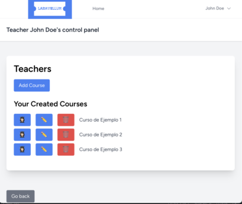

```yaml
Hi there!
I'm Felipe Marín: a cross-platform app developer trainee
with a knack for optimizing resources and improving operational processes in airports.
```

<!-- Profile Views -->
<p align="left">
  
</p>


**Academic Projects**

|  |  |  |
|---|---|---|
| **[Gestor de Turnos](https://github.com/flpmarin/GestorDeTurnos)** | **[Course Manager](https://github.com/jaimemoralmillan/proyectoGestorCursos)** | **[Videogame Hub Backend](https://github.com/flpmarin/videogame-hub-backend)** |
| Java application using Swing to organize workers' shifts and positions. The application enables shift management, absence handling, work hour limits and shift assignment. | A web application for managing courses and enrollments, built with Laravel. Teachers can manage courses and students, while students can view available courses and their enrollments. | Backend built with Spring Boot. It provides APIs for managing video games and fetching gaming news. The backend is designed to integrate with the [Vue.js frontend](https://github.com/flpmarin/videogame-hub-frontend). |
| `Java` `Swing` `Maven` `JDBC` | `Laravel` `Blade` `JetStream-Authentication` | `Spring Boot` `MySQL` `RESTful APIs` `Vue.js` |


[](https://github.com/flpmarin)


<!-- Languages and Markup -->
**Tech Stack Explored**
  <p>
  
  
  
  
  
  
</p>


<p>
  <!-- Frameworks and Libraries (Green Theme) -->
  
  
  
  
  
  
  
</p>


<p>
  <!-- Databases (Orange Theme) -->
  
  
  
  </p>


<!-- GitHub Stats Section -->
<details>
  <summary><h3> Stats</h3></summary>
  
  <p align="left">
    
    
  </p>
</details>


